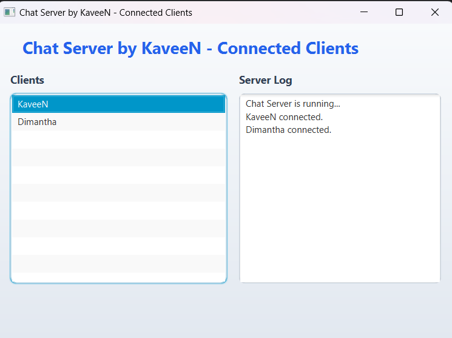

# Group Chat Application by KaveeN

## Project Overview

A modern JavaFX-based group chat application that enables real-time messaging between multiple clients and a server. The UI is clean and user-friendly, with a dedicated connect screen, chat window, and server dashboard.

---

## Features

- **Real-time Messaging:** Instantly send and receive messages.
- **Multi-client Support:** Multiple users can join and chat simultaneously.
- **Server Dashboard:** View connected clients and server logs in real time.
- **Modern JavaFX UI:** Responsive and visually appealing interface.
- **Simple Setup:** No database or external dependencies required.

---

## Project Demo

### Server UI



### Client UI


---

## Technologies Used

- **Java 17+**
- **JavaFX 17+**
- **Maven** (for build and dependency management)
- **Socket Programming** (for networking)

---

## Clone the Repository

To clone the repository, use the following commands:

```sh
git https://github.com/KaveenDK/Chat-Room-Application.git
cd Chat-Room-Application
```

## Project Structure
```
Chat-Room-Application/
├── src/
│   └── main/
│       ├── java/
│       │   └── lk/ijse/edu/chatroomapplication/
│       │       ├── ChatClientApp.java
│       │       ├── ChatServerApp.java
│       │       └── Controller/
│       │           ├── ChatClientController.java
│       │           ├── ChatServerController.java
│       │           └── ClientConnectController.java
│       └── resources/
│           └── view/
│               ├── ChatClientView.fxml
│               ├── ChatServerView.fxml
│               └── ClientConnectView.fxml
├── screenshots/
│   ├── client-ui.png
│   └── server-ui.png
├── pom.xml
└── README.md
```

---

## How to Run

1. **Clone the repository:**
2. Run the `ChatServerApp.java` to start the server.
3. Run the `ChatClientApp.java` to start the client.
4. Use the UI to send text messages and share images between client and server.

## Future Enhancements

- **Image/file sharing**: Allow users to send images and files.
- **Message history**: Save and display previous conversations.
- **Authentication**: Implement user authentication for secure access.
- **UI themes and animations**: Add more themes and animations for a better user experience.

## ☕ Support Me

If you found this project helpful, consider supporting me:

<a href="https://www.buymeacoffee.com/vpdkkaveenp" target="_blank">Buy me a coffee</a>

